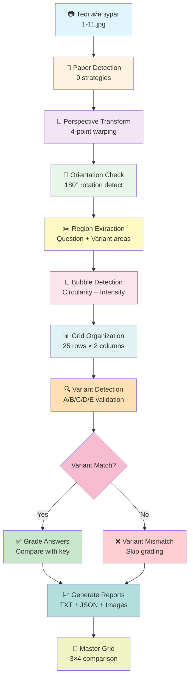

<div align="center">
OMR Based Automated Exam Grading System


9 аргаас хуудас илрүүлэлт, 4-Point Perspective Transform, бөглөсөн бөмбөлгийн танилт, A–E хувилбар баталгаажуулалт, 50 асуултын автомат үнэлгээ хийдэг бүрэн AI шалгалт засах систем

🚀 Эхлэх
 • 📖 Хэрхэн ажилладаг
 • 🎯 Онцлог
 • 📊 Үр дүн

---

</div>

## ✨ Онцлог шинж чанарууд

<table>
<tr>
<td width="50%">

### 🎯 Хуудасны урьдчилсан боловсруулалт
- Тестийн хуудас илрүүлэх 9 арга, оноо өгөх систем
- 4 өнцгийн координатаар хуудас тэгшлэх (Perspective transform)
- 180° эргэх эсэхийг автоматаар шийдэх
- Гэрэлтүүлэг жигдрүүлэх (CLAHE + Adaptive threshold)

</td>
<td width="50%">

### 🔍 Хариу танилт ба баталгаажуулалт
- 50 асуултыг 25 мөр × 2 баганаар зохион байгуулах
- A–E хувилбарын бөглөсөн хэсгийг автоматаар шалгаж баталгаажуулах
- Бөмбөлөг илрүүлэх (талбай, дугуй хэлбэр, харанхуй эсэх шинжилгээ)
- Мөр ангилах (Y-координатын босгоор бүлэглэх)
- Итгэлцлийн үнэлгээ (Confidence score)

</td>
</tr>
<tr>
<td width="50%">

### 📝 Автомат Засалт
- ✅ **Answer Key Processing** - Хариултын загвар боловсруулах
- ✅ **Batch Grading** - 10 хүртэл оюутныг нэгэн зэрэг засах
- ✅ **Variant Matching** - Зөв хувилбарыг шалгаж засах
- ✅ **Visual Feedback** - Зөв/буруу харуулсан визуал үүсгэх
- ✅ **Detailed Reports** - TXT & JSON тайлан гаргах

</td>
<td width="50%">

### 📈 Дэлгэрэнгүй Тайлан
- ✅ **Score Statistics** - Дундаж, медиан, std deviation
- ✅ **Master Comparison Grid** - 3x4 харьцуулалтын график
- ✅ **Per-Question Analysis** - Асуулт бүрийн дэлгэрэнгүй
- ✅ **Error Detection** - Хувилбар зөрүү илрүүлэлт
- ✅ **JSON Export** - Програмаар ашиглах боломжтой

</td>
</tr>
</table>

---

## 🔄 Хэрхэн ажилладаг



---

## 🚀 Installation

### Шаардлагатай зүйлс

```bash
Python 3.7+
opencv-python >= 4.5.0
numpy >= 1.19.0
matplotlib >= 3.3.0
scikit-learn >= 0.24.0
pathlib (Python 3.4+ built-in)
```

### Суулгах заавар

```bash
# Repository-г clone хийх
git clone https://github.com/iamurhope/OMR_Based_Automated_Exam_Grading_System.git

# Хавтас руу орох
cd OMR_Based_Automated_Exam_Grading_System

# Шаардлагатай package суулгах
pip install opencv-python numpy matplotlib scikit-learn

# Эсвэл requirements файлаас
pip install -r requirements.txt
```

---

## 💻 Хэрэглээ

### 1️⃣ Batch Processing Mode (10 оюутан нэгэн зэрэг)

```python
# Зураг файлуудыг бэлтгэх
# 1.jpg, 2.jpg, ..., 11.jpg (оюутны тестууд)
# shablom.jpg (хариултын загвар)

# Программыг ажиллуулах
python omr_grading_system.py
```

**Процесс:**
1. Бүх зургуудыг perspective correct хийнэ → `corrected_*.jpg`
2. Answer key боловсруулна → `corrected_shablom.jpg`
3. 10 оюутныг засна
4. Master comparison grid үүсгэнэ

### 2️⃣ Single Image Mode (Нэг оюутан засах)

```python
results = batch_process_omr_with_variants(
    input_folder='.',
    output_folder='omr_results',
    answer_key_filename='corrected_shablom.jpg',
    single_image='corrected_1.jpg',
    student_name='Student_1'
)
```

### 3️⃣ Answer Key шалгах

```python
results = batch_process_omr_with_variants(
    input_folder='.',
    output_folder='test',
    answer_key_filename='corrected_shablom.jpg',
    single_image='corrected_shablom.jpg',
    student_name='Answer_Key_Test'
)
```

---

## 📊 Үр дүнгийн бүтэц

Програм дараах хавтас, файлуудыг үүсгэнэ:

```
omr_results/
├── comparisons/
│   ├── Student_1_graded.png          # Засалттай визуал
│   ├── Student_1_detection.png       # Bubble detection
│   ├── Student_1_variant.png         # Variant detection
│   └── Student_1_comparison.png      # Хариулт харьцуулалт
│
├── reports/
│   ├── ANSWER_KEY.txt               # Хариултын загвар
│   ├── Student_1_report.txt         # Дэлгэрэнгүй тайлан
│   ├── OVERALL_SUMMARY.txt          # Нийт статистик
│   └── results.json                 # JSON export
│
├── visualizations/
│   ├── answer_key_detection.png     # Answer key bubble detection
│   └── answer_key_variant.png       # Answer key variant
│
└── MASTER_COMPARISON_GRID.png       # 3x4 харьцуулалтын график
```

---

## 🎯 Онцлох Функцууд

### 1️⃣ Ultra-Robust Paper Detection
9 өөр edge detection стратеги ашиглаж тестийн хуудсыг илрүүлнэ:
- **CLAHE enhancement** - Adaptive histogram equalization
- **Multiple Canny edges** - 5 өөр threshold combination
- **Threshold methods** - OTSU, Binary, Adaptive
- **Sobel gradients** - Edge direction detection
- **Scoring system** - Area, rectangularity, angle, center position

```python
# Дөрвөн өнцөг илрүүлэлтийн score тооцоолол
score = (area ** 0.9) * (rectangularity ** 1.4) * 
        (angle_score ** 1.1) * (center_score ** 0.6) * 
        (edge_penalty ** 1.8) * left_edge_bonus
```

### 2️⃣ Intelligent Bubble Detection
Circularity болон intensity шинжилгээ:
- **Size filtering**: 80-2500 pixels area
- **Aspect ratio check**: 0.4-2.0 range
- **Circularity score**: `4π × area / perimeter²`
- **Interior intensity**: Center region darkness check
- **Duplicate removal**: Position-based filtering

### 3️⃣ Grid Organization Algorithm
Y-threshold ашиглан 25 мөр × 2 багана бүлэглэх:
```python
y_threshold = max(18, avg_bubble_height * 0.75)
```
- Мөр илрүүлэлт - Y координатаар
- Баганы ялгалт - Том зайгаар split
- 5 сонголттой асуулт бүрээс

### 4️⃣ Variant Validation System
A, B, C, D, E хувилбарыг шалгаж таньж:
- Top-right region дээр хайна
- Contrast-based detection
- Confidence scoring
- **VARIANT MISMATCH DETECTION** - Буруу хувилбарыг автоматаар илрүүлнэ

### 5️⃣ Orientation Detection
3 voting mechanism ашиглан 180° эргэх шаардлагыг шалгана:
- **Content density** - Top vs bottom текст хэмжээ
- **Bubble distribution** - Хаана бөмбөлөг их байна
- **Edge density** - Ирмэгийн тархалт

---

## Технологи & Алгоритм

<div align="center">

| Компонент | Технологи | Хэрэглээ |
|-----------|----------|----------|
| **Paper Detection** | OpenCV Canny, CLAHE, Morphology | 9 стратеги, scoring system |
| **Perspective Transform** | `getPerspectiveTransform` | 4-point warping + padding |
| **Bubble Detection** | Adaptive Threshold, Contours | Circularity + intensity |
| **Grid Organization** | DBSCAN-inspired clustering | Y-threshold grouping |
| **Variant Detection** | ROI extraction, Contour analysis | Top-right region scan |
| **Answer Matching** | NumPy array comparison | Intensity-based selection |
| **Grading Logic** | Python dictionaries | Key-value comparison |
| **Visualization** | Matplotlib + OpenCV drawing | Multi-panel grids |
| **Reports** | JSON + TXT export | Structured data output |

</div>

###  Алгоритмын Онцлог

**Paper Detection Scoring:**
```python
score = (area ** 0.9) × (rectangularity ** 1.4) × 
        (angle_score ** 1.1) × (center_score ** 0.6) × 
        (edge_penalty ** 1.8) × left_edge_bonus
```

**Bubble Circularity Check:**
```python
circularity = 4π × area / (perimeter²)
# Шалгуур: circularity > 0.3
```

**Filled Bubble Detection:**
```python
if min_intensity < 180:
    confidence = 0.9
elif min_intensity < 195 and contrast >= 5:
    confidence = 0.85
```

---

## 🛠️ Тохиргоо & Параметрүүд

### Bubble Detection Parameters

```python
# Bubble хэмжээний хязгаар
MIN_AREA = 80        # Хамгийн бага талбай (пиксел²)
MAX_AREA = 2500      # Хамгийн их талбай (пиксел²)

# Circularity шалгуур
MIN_CIRCULARITY = 0.3  # Дугуй хэлбэрийн шалгуур

# Aspect ratio
MIN_ASPECT = 0.4      # Өргөн/өндөр хамгийн бага
MAX_ASPECT = 2.0      # Өргөн/өндөр хамгийн их
```

### Grid Organization Parameters

```python
# Y-threshold тооцоолол
y_threshold = max(18, avg_bubble_height * 0.75)

# Мөрийн тоо
TOTAL_ROWS = 25       # 25 асуултын мөр
QUESTIONS_PER_ROW = 2 # Мөр бүрт 2 асуулт (L+R)
TOTAL_QUESTIONS = 50  # Нийт 50 асуулт
CHOICES_PER_Q = 5     # Асуулт бүр 5 сонголт (A-E)
```

### Region тайралт

```python
# Question region
crop_y1 = int(h * 0.08)  # Top: 8%
crop_y2 = int(h * 0.98)  # Bottom: 98%
crop_x1 = int(w * 0.05)  # Left: 5%
crop_x2 = int(w * 0.65)  # Right: 65%

# Variant region
y_start = int(h * 0.06)  # Top: 6%
y_end = int(h * 0.22)    # Bottom: 22%
x_start = int(w * 0.60)  # Left: 60%
x_end = int(w * 0.92)    # Right: 92%
```

---

## Example report

### Student Report (TXT формат)

```
================================================================================
✓ GRADING SUCCESSFUL
================================================================================

STUDENT: Student_1
VARIANT: A (VERIFIED ✓)
SCORE: 42/50 (84.0%)
================================================================================

SUMMARY:
  ✓ Correct:   42 (84.0%)
  ✗ Incorrect:  5 (10.0%)
  ○ Blank:      3 (6.0%)

================================================================================

DETAILED BREAKDOWN:
────────────────────────────────────────────────────────────────────────────────
Q#    Student    Correct    Status         
────────────────────────────────────────────────────────────────────────────────
1     A          A          ✓ correct
2     B          B          ✓ correct
3     C          D          ✗ incorrect
4     -          A          ○ blank
...
```

### Overall Summary Statistics

```
STATISTICS:
  Average score: 38.2/50
  Average percentage: 76.4%
  Highest score: 45/50 (90.0%)
  Lowest score: 32/50 (64.0%)
  Median score: 39.0/50
  Standard deviation: 8.3%
```